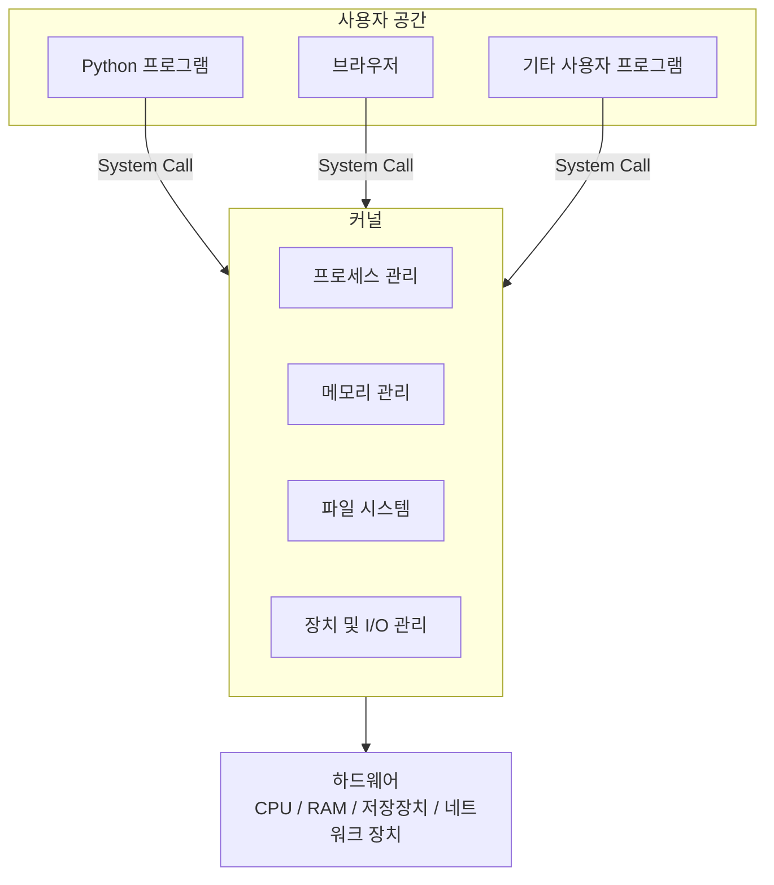
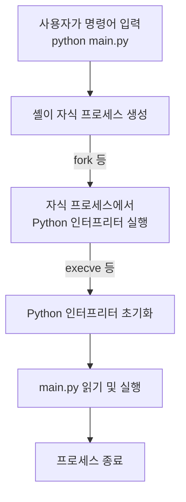
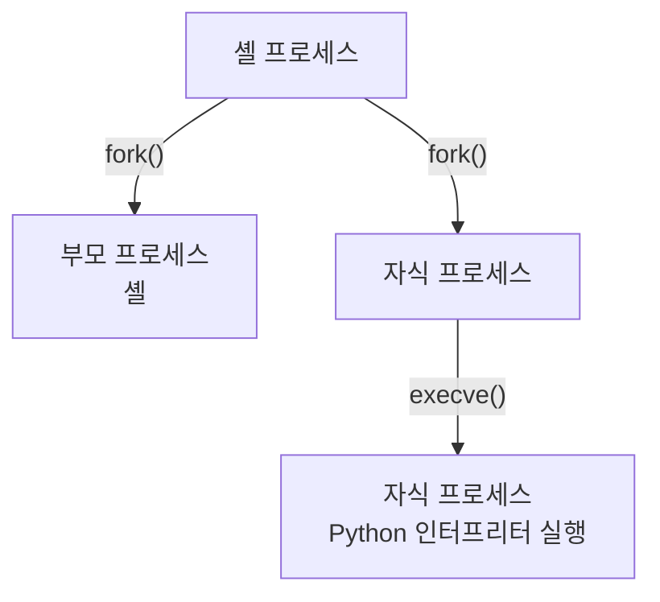
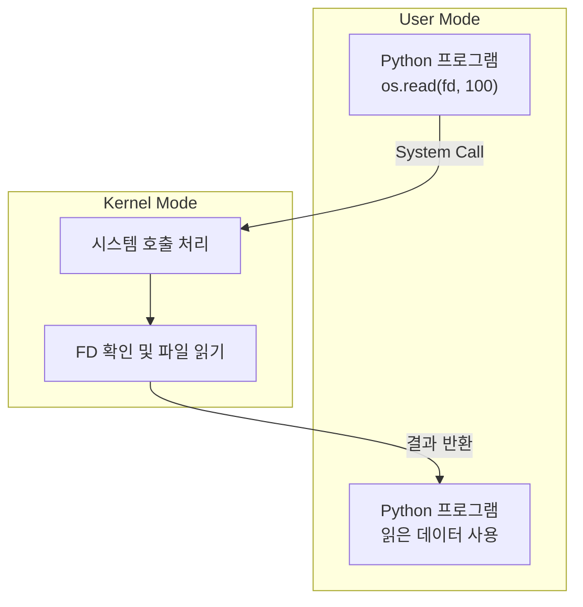

Python에서 작성한 코드는 어떻게 실행될까?

일반적으로 Python 프로그램을 실행할 때 다음과 같은 명령어를 사용한다.

```bash
python main.py
```

명령어를 입력하면 Python 인터프리터가 실행되고 `main.py`에 작성된 코드가 실행된다.

하지만 이 과정에서 운영체제는 어떤 역할을 할까? Python 프로그램은 어떻게 CPU와 메모리를 사용하고, 다른 프로그램과 독립적으로 실행될 수 있을까?

이 과정을 이해하기 위해서는 먼저 운영체제, 커널, 프로세스의 관계를 알아야 한다.

이번 편에서는 운영체제의 역할을 살펴보고, Python 프로그램이 프로세스로 실행되는 과정과 User Mode, Kernel Mode의 개념을 알아본다.

---

## 1. 운영체제와 커널

### 운영체제의 역할

운영체제(Operating System, OS)는 하드웨어 자원을 관리하고 프로그램이 실행될 수 있는 환경을 제공하는 시스템 소프트웨어다.

예를 들어 Python 프로그램을 실행하려면 CPU와 메모리가 필요하다. 파일을 읽거나 네트워크로 데이터를 전송하려면 저장장치와 네트워크 장치에도 접근해야 한다.

하지만 일반적인 Python 프로그램은 이러한 하드웨어 자원을 직접 관리하지 않는다.

대신 운영체제가 제공하는 기능을 사용한다.

운영체제의 주요 역할은 다음과 같다.

| 역할 | 설명 |
|---|---|
| 프로세스 관리 | 프로그램 실행, CPU 스케줄링, 프로세스 생성 및 종료 |
| 메모리 관리 | 메모리 할당, 가상 메모리 관리, 메모리 보호 |
| 파일 시스템 | 파일과 디렉터리 관리 |
| 장치 및 I/O 관리 | 저장장치, 네트워크 장치 등의 입출력 관리 |

이러한 기능을 담당하는 운영체제의 핵심 구성요소가 커널(Kernel)이다.

### 커널이란 무엇인가?

커널은 운영체제의 핵심 구성요소로, 하드웨어 자원을 관리하고 프로그램이 사용할 수 있는 서비스를 제공한다.

일반적인 운영체제는 커널뿐만 아니라 셸, 시스템 유틸리티 등 여러 구성요소를 포함한다.

따라서 운영체제와 커널은 완전히 동일한 개념은 아니다.

다음은 사용자 프로그램, 커널, 하드웨어 사이의 관계를 단순화한 구조다.



사용자 프로그램은 커널이 제공하는 서비스를 통해 파일, 네트워크 등 시스템 자원에 접근할 수 있다.

이때 사용자 프로그램이 커널에 서비스를 요청하는 대표적인 인터페이스가 시스템 호출(System Call)이다.

시스템 호출은 뒤에서 다시 살펴본다.

---

## 2. 프로그램과 프로세스

운영체제가 프로그램을 실행하고 관리한다는 것은 구체적으로 어떤 의미일까?

이를 이해하려면 먼저 프로그램과 프로세스를 구분해야 한다.

### 프로그램이란?

프로그램(Program)은 실행 가능한 명령어와 데이터로 구성된 것이다.

예를 들어 Python 인터프리터는 실행 가능한 프로그램이며, `main.py`는 Python 인터프리터가 실행할 소스 코드다.

```python
# main.py

print("Hello, World!")
```

이 소스 파일은 디스크에 저장되어 있다는 이유만으로 실행 중인 프로세스가 되지는 않는다.

Python 인터프리터가 해당 파일을 읽고 실행해야 한다.

### 프로세스란?

프로세스(Process)는 실행 중인 프로그램의 인스턴스다.

프로세스는 프로그램 코드뿐만 아니라 실행에 필요한 여러 상태와 자원을 가진다.

대표적으로 다음과 같은 정보가 있다.

- 프로세스 식별자(PID)
- 가상 주소 공간
- 실행 상태 및 CPU 레지스터 정보
- 열린 파일과 기타 시스템 자원

운영체제는 이러한 정보를 관리하면서 여러 프로세스가 실행될 수 있도록 한다.

프로그램과 프로세스의 차이를 정리하면 다음과 같다.

| 구분 | 프로그램 | 프로세스 |
|---|---|---|
| 의미 | 실행 가능한 명령어와 데이터 | 실행 중인 프로그램의 인스턴스 |
| 특징 | 저장된 코드와 데이터 | 실행 상태와 시스템 자원을 가짐 |
| 예시 | Python 인터프리터 실행 파일 | 실행 중인 Python 프로세스 |

하나의 프로그램에서 여러 프로세스가 만들어질 수도 있다.

예를 들어 서로 다른 터미널에서 동일한 Python 프로그램을 실행하면, 각각 별도의 프로세스로 실행될 수 있다.

---

## 3. Python 프로그램은 어떻게 프로세스가 되는가?

Linux 환경에서 다음 명령어를 실행한다고 가정해 보자.

```bash
python main.py
```

일반적인 셸 환경에서는 다음과 같은 과정을 거쳐 Python 프로그램이 실행된다.



각 단계를 살펴보자.

### 3.1. 셸에서 명령어 입력

터미널에서 명령어를 입력하면 셸(Shell)이 이를 해석한다.

셸은 사용자가 운영체제의 기능을 이용할 수 있도록 명령어 인터페이스를 제공하는 프로그램이다.

예를 들어 Bash나 Zsh가 있다.

```bash
python main.py
```

셸은 실행할 프로그램을 찾고 필요한 인자를 준비한다.

### 3.2. 자식 프로세스 생성

전형적인 Unix 계열 셸은 외부 프로그램을 실행할 때 자식 프로세스를 생성한다.

Linux에서 프로세스를 생성하는 대표적인 시스템 호출 중 하나가 `fork()`다.

`fork()`는 호출한 프로세스를 기반으로 새로운 자식 프로세스를 생성한다.

이때 기존 프로세스를 부모 프로세스(Parent Process), 새로 생성된 프로세스를 자식 프로세스(Child Process)라고 한다.

자식 프로세스는 부모의 여러 실행 환경을 물려받지만, 별도의 PID와 독립적인 실행 상태를 가진다.

단, 실제 셸과 실행 환경에 따라 프로세스 생성 방식은 달라질 수 있다.

### 3.3. Python 인터프리터 실행

자식 프로세스가 만들어졌다면 Python 인터프리터를 실행해야 한다.

Unix 계열 운영체제에서는 `execve()`와 같은 시스템 호출을 통해 현재 프로세스에서 새로운 프로그램을 실행할 수 있다.

중요한 점은 `execve()` 자체가 새로운 프로세스를 생성하지 않는다는 것이다.

기존 프로세스의 프로그램 이미지를 새로운 프로그램으로 교체하는 방식이다.

일반적인 `fork()`와 `execve()`의 조합을 단순화하면 다음과 같다.



자식 프로세스에서 Python 인터프리터가 실행되면 인터프리터 초기화가 진행된다.

이후 Python은 전달받은 `main.py`를 읽고 코드를 실행한다.

Python 코드의 컴파일과 실행 과정은 별도의 Python 실행 시리즈에서 다룰 수 있다.

---

## 4. Python으로 프로세스 확인하기

지금까지 살펴본 내용을 Python 코드로 확인해 보자.

Python의 `os` 모듈을 사용하면 현재 프로세스의 PID와 부모 프로세스의 PID를 확인할 수 있다.

다음 코드를 작성한다.

```python
# main.py

import os
import time

print(f"PID: {os.getpid()}", flush=True)
print(f"PPID: {os.getppid()}", flush=True)

time.sleep(60)
```

`os.getpid()`는 현재 프로세스의 PID를 반환한다.

`os.getppid()`는 부모 프로세스의 PID를 반환한다.

`time.sleep(60)`은 프로세스를 60초 동안 유지해 다른 터미널에서 확인할 시간을 확보하기 위한 코드다.

터미널에서 프로그램을 실행한다.

```bash
python main.py
```

실행 결과는 다음과 같은 형태로 출력된다.

```text
PID: 12345
PPID: 12000
```

PID는 실행할 때마다 달라질 수 있다.

이제 다른 터미널을 열어 다음 명령어를 실행한다.

```bash
ps -p 12345 -o pid,ppid,stat,comm,args
```

여기서 `12345`는 실제 Python 프로그램에서 출력된 PID로 변경한다.

`ps`는 실행 중인 프로세스의 정보를 확인하는 명령어다.

각 출력 항목은 다음과 같다.

| 항목 | 의미 |
|---|---|
| PID | 프로세스 식별자 |
| PPID | 부모 프로세스 식별자 |
| STAT | 프로세스 상태 |
| COMM | 실행 프로그램 이름 |
| ARGS | 실행 명령어와 인자 |

이번에는 다른 터미널에서 동일한 Python 프로그램을 한 번 더 실행해 보자.

서로 다른 PID가 출력되는 것을 확인할 수 있다.

이는 동일한 프로그램을 실행하더라도 각각 별도의 프로세스가 만들어질 수 있다는 것을 보여준다.

---

## 5. User Mode와 Kernel Mode

그렇다면 Python 프로그램이 실행되는 동안 CPU와 메모리 같은 하드웨어 자원에는 어떻게 접근할까?

이를 이해하기 위해서는 User Mode와 Kernel Mode를 알아야 한다.

현대 운영체제는 일반적으로 하드웨어가 제공하는 권한 수준을 활용해 사용자 프로그램과 커널의 실행 권한을 구분한다.

### User Mode

User Mode는 일반적인 사용자 프로그램이 실행되는 제한된 권한의 실행 모드다.

일반적인 Python 프로그램도 User Mode에서 실행된다.

User Mode에서는 보호된 커널 메모리에 직접 접근하거나 특정 특권 명령을 실행하는 등의 작업이 제한된다.

이는 사용자 프로그램의 오류나 잘못된 접근으로부터 운영체제와 다른 프로세스를 보호하기 위한 것이다.

### Kernel Mode

Kernel Mode는 커널이 높은 실행 권한으로 동작할 수 있는 실행 모드다.

커널은 이 모드에서 메모리 관리, 장치 제어 등 보호된 시스템 작업을 수행할 수 있다.

두 모드를 비교하면 다음과 같다.

| 구분 | User Mode | Kernel Mode |
|---|---|---|
| 주요 실행 주체 | 일반적인 사용자 프로그램 | 커널 |
| 실행 권한 | 제한된 권한 | 높은 권한 |
| 보호된 커널 자원 | 직접 접근 제한 | 접근 가능 |
| 주요 역할 | 애플리케이션 실행 | 시스템 자원 관리 |

여기서 주의할 점이 있다.

User Mode와 Kernel Mode는 프로세스의 종류가 아니라 CPU의 실행 권한을 구분하는 개념이다.

일반적인 사용자 프로세스도 시스템 호출을 실행하면 해당 요청을 처리하기 위해 커널 코드가 Kernel Mode에서 실행될 수 있다.

---

## 6. System Call은 왜 필요한가?

일반적인 Python 프로그램은 User Mode에서 실행되기 때문에 보호된 시스템 자원에 직접 접근할 수 없다.

따라서 커널이 제공하는 기능을 사용해야 한다.

이때 사용하는 인터페이스가 시스템 호출(System Call)이다.

예를 들어 Python에서 파일을 읽는다고 가정해 보자.

```python
import os

fd = os.open("example.txt", os.O_RDONLY)

data = os.read(fd, 100)

os.close(fd)
```

Linux에서 이러한 작업은 일반적으로 커널의 파일 관련 시스템 호출을 통해 수행된다.

`os.read()`를 호출하면 Python은 해당 운영체제의 시스템 호출 인터페이스를 이용해 커널에 파일 읽기를 요청한다.

커널은 요청을 처리하고 결과를 반환한다.



여기서 FD(File Descriptor)는 프로세스가 열린 파일 등의 I/O 자원을 참조하기 위해 사용하는 정수 식별자다.

FD의 구조와 역할은 03편에서 자세히 살펴본다.

이번 편에서는 사용자 프로그램이 커널의 기능을 사용하기 위해 시스템 호출을 이용한다는 점만 이해하면 충분하다.

---

## 7. 정리

이번 편에서는 Python 프로그램이 프로세스로 실행되는 과정을 중심으로 운영체제의 기본 개념을 살펴봤다.

핵심 내용을 정리하면 다음과 같다.

1. 운영체제는 하드웨어 자원을 관리하고 프로그램의 실행 환경을 제공한다.
2. 커널은 운영체제의 핵심 구성요소로, 프로세스와 메모리 등의 시스템 자원을 관리한다.
3. 프로세스는 실행 중인 프로그램의 인스턴스이며, 각각 고유한 실행 상태와 자원을 가진다.
4. Linux에서 일반적인 셸은 `fork()`와 `execve()` 등을 이용해 외부 프로그램을 실행할 수 있다.
5. 일반적인 Python 프로그램은 User Mode에서 실행되며, 커널의 서비스가 필요하면 System Call을 사용한다.

이제 Python 프로그램이 운영체제 위에서 실행되는 기본 구조를 이해했다.

하지만 아직 한 가지 질문이 남아 있다.

Python에서 `os.read()`를 호출했을 때, User Mode에서 실행 중인 프로그램은 구체적으로 어떤 과정을 거쳐 커널에 작업을 요청할까?

다음 편에서는 **System Call과 User Mode에서 Kernel Mode로 전환되는 과정**을 살펴본다.

